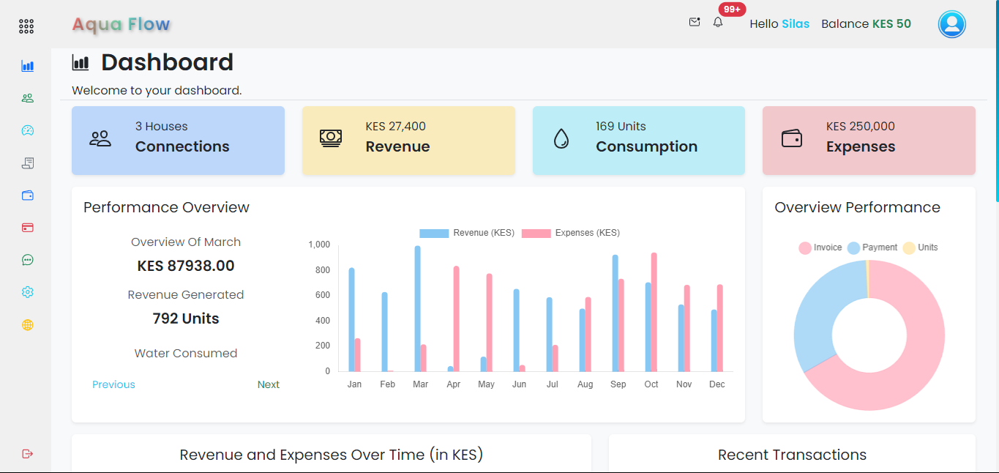
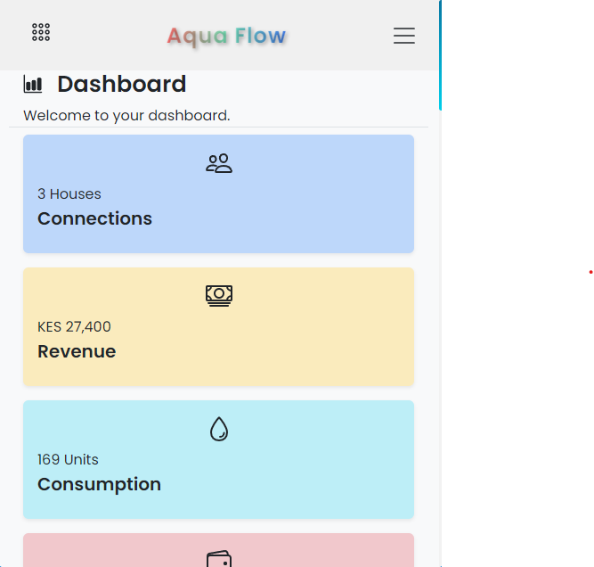
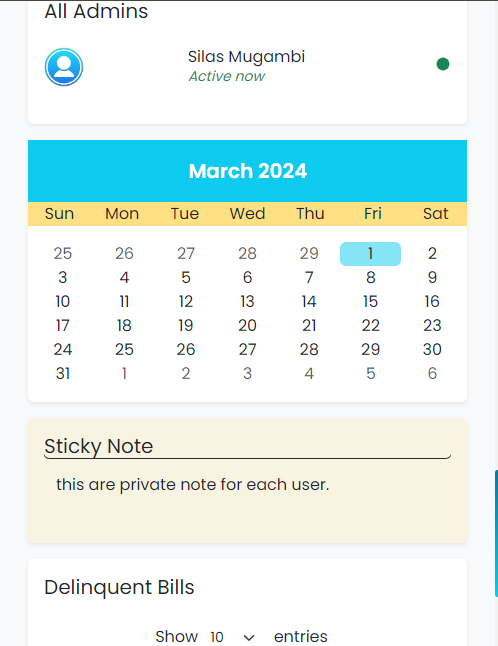

# Water Management System


## Overview

The Water Management System is a Flask-based web application designed to optimize and streamline water management processes. By leveraging modern technology, it empowers users to monitor, manage, and communicate about water usage effectively.

## Features

- **Secure User Management:** The system allows users to securely register, log in, and log out, with password reset functionality for account recovery.
- **Role-Based Access Control:** Assigns different access levels (e.g., standard user, administrator) for enhanced security and control.
- **Dynamic Dashboards:** Offers personalized insights into water usage through interactive charts and graphs.
- **Water Consumption and Expense Tracking:** Enables monitoring of water usage and associated costs for responsible water management.
- **Real-Time Chat:** Facilitates user communication and collaboration.
- **Admin Broadcast Messages:** Administrators can share announcements and updates with users.
- **Feedback Tracking System:** Collects user input to improve the application continuously.

## Demonstrations

Here are some visual examples of the system's key features:

### Dashboard


_The system dashboard provides an overview of water usage and management activities._

### Mobile Application



_The mobile application's home screen offers quick access to essential controls and information._



_Users can access detailed information and manage specific settings through the mobile app._

## Tech Stack

The Water Management System is built with the following technologies:

- **Python:** Backend development.
- **Flask:** Web framework.
- **Blueprints:** Modular structure.
- **WebSockets (Flask-SocketIO):** Real-time communication.
- **Bootstrap, CSS, and HTML:** Frontend design.
- **JavaScript:** Interactive elements.

## Getting Started

### Prerequisites

Ensure you have the following prerequisites installed on your system:

- **Python:** Download and install Python from the [official Python website](https://www.python.org/).
- **Virtual Environment:** Recommended for managing dependencies and isolating the project environment.

  #### Creating a Virtual Environment:

  - **Using `venv` (Python 3):**

    ```cmd
    > python -m venv venv
    > venv\Scripts\activate
    ```

  - **Using `virtualenv`:**
    ```cmd
    > pip install virtualenv
    > virtualenv venv
    > venv\Scripts\activate
    ```

### Installation

1. **Clone the repository:**

   ```cmd
   > git clone https://github.com/mugambi12/wms.git
   > cd wms
   ```

2. **Install dependencies:** Navigate to the project directory and install the required dependencies:
   ```cmd
   > pip install -r requirements.txt
   ```

### Usage

1. **Navigate to `WMS` folder:**

   ```cmd
   > cd wms
   ```

2. **Run the application:** Start the Flask server:

   - **Using `run.py`:**

     ```cmd
     > python run.py
     ```

   - **Using Flask CLI:**
     ```cmd
     > flask run
     ```

   The application will be accessible at `http://localhost:5000`.

3. **Access the application:** Open your web browser and navigate to `http://localhost:5000` to explore the system.

4. **Explore the features:** Try out user management, dashboards, water consumption tracking, and more.

5. **Contribute (optional):** Contributions are welcome! Fork the repository, make changes, and submit a pull request.


### licence 

- Licenced under MIT

---
